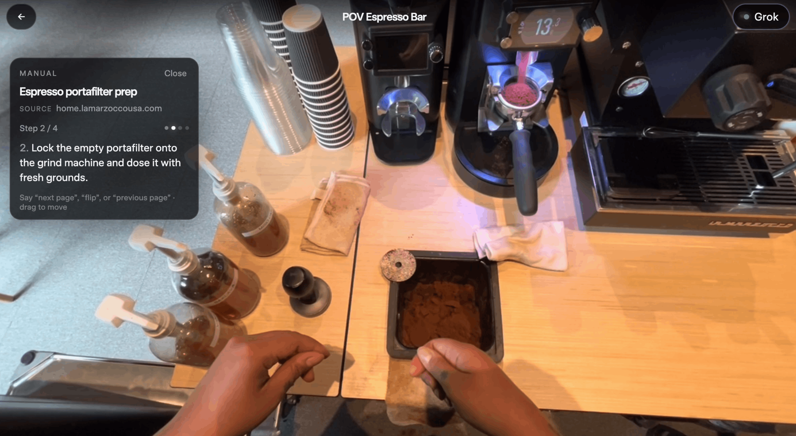
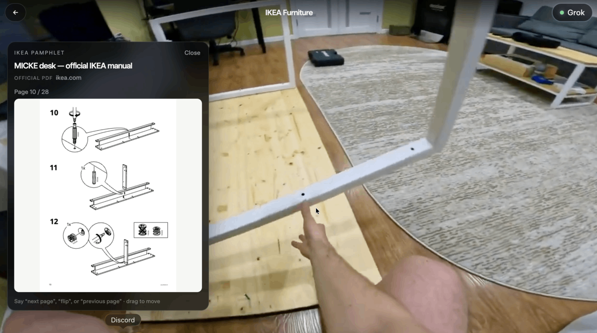

# GrokEye

**Grok-Augmented Reality** for physical work — hands-free coaching that sees through the camera, answers out loud, and points at exactly where things go.

Built for [Grokathon 2026](https://x.ai).

## Demo

Watch the walkthrough: **[GrokEye on YouTube](https://www.youtube.com/watch?v=lC4oP8kb9KE)**

| Espresso portafilter coaching | IKEA assembly guide |
| --- | --- |
|  |  |

## What it does

GrokEye looks through the worker’s eyes, speaks the fix, and highlights the exact spot — voice-controlled, hands-free. Ask how-tos and it pulls real web instructions; ask “check my work” and it verifies what you did against a saved connection task or recent frames.

- **Live AR guidance** — boxes, connection arrows, and spoken cues over catalog clips or a webcam
- **Web how-to manuals** — say “show me how to make sushi” / open the coffee or IKEA guide
- **Step correctness review** — “how did I do on that step?” with frame strips + spoken verdict
- **Work verify** — connection answers can seal as tasks; “check my work” compares before vs after
- **Extras** — Spotify / YouTube by voice, live camera mode, organization intelligence page

## Tech stack

| Layer | What we use |
| --- | --- |
| **Speech in** | Chrome / Chromium **Web Speech API** (STT) — no speech API key in this app |
| **Speech out** | **xAI TTS** — voice `carina` via `/api/tts` |
| **Brain** | **Grok** (`grok-4.5`) for Q&A, vision boxes, manuals, verify, step review |
| **Web instructions** | Phrase-match → `/api/manual` → Grok + **web_search** → step JSON |
| **Highlights** | On-device color (e.g. salmon) → optional local YOLO pack → **Grok multimodal boxes** (hedged multi-draw); custom **JS tracker** (no OpenCV) keeps boxes glued while video plays |
| **App** | React + Vite client, Express API, optional Python detector |

**Voice path in one line:** mic → Chrome Web Speech (text) → GrokEye intent routing → Grok / tools → Carina speaks the reply.

## Setup

```bash
cp .env.example .env
# put your XAI_API_KEY in .env

npm install
npm run detect:setup   # once — optional local detector venv
npm run dev
```

Open [http://localhost:5173](http://localhost:5173). Use **Chrome** for voice.

## Usage

1. Pick a video from the home library, or **Live Camera**.
2. Talk freely (or tap the mic). Examples: “where does this connect?”, “open the coffee manual”, “check my work”, “how did I do?”
3. **Space** play/pause · arrow keys scrub catalog clips.
4. Optional Spotify: see `.env.example` and [developer.spotify.com/dashboard](https://developer.spotify.com/dashboard) (`http://127.0.0.1:5173/api/spotify/callback`).

## Add videos

Drop files under `public/videos/` and append an entry to `public/videos/manifest.json`.

## Note

Keep `XAI_API_KEY` in `.env` only — never commit it.
